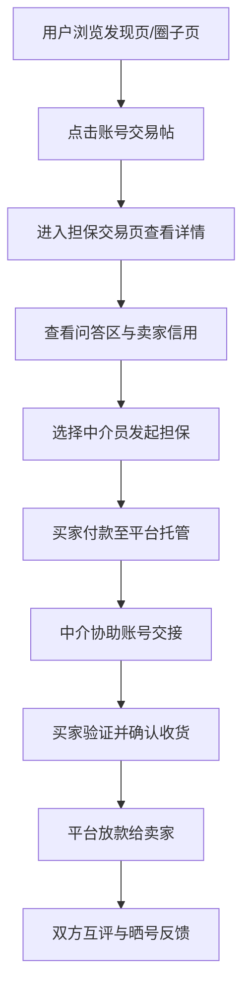

## 1. 产品概述

同校游戏账号二手担保交易社区平台，面向学生玩家群体，主打"同好可信交易"理念。通过社交化社区运营，结合担保中介机制，降低学生购号踩坑风险，打造一个集交易、社交、经验共享于一体的垂直社区。

- 核心目标：解决学生群体游戏账号交易中的信任问题，通过同校圈层、社区口碑、担保中介三重保障建立可信交易环境
- 目标用户：高校学生玩家、同城年轻游戏爱好者
- 市场价值：填补学生圈层游戏账号交易的空白，区别于通用二手平台，提供更专业、更社交化的交易体验

## 2. 核心功能

### 2.1 用户角色

| 角色 | 注册方式 | 核心权限 |
|------|----------|----------|
| 普通用户 | 手机号/校园邮箱注册 | 浏览帖子、发布交易帖、参与问答、完成交易、信用评价 |
| 认证中介员 | 平台审核认证 | 担保交易处理、纠纷调解、交易资金托管、中介值班展示 |
| 管理员 | 后台管理 | 用户管理、内容审核、违规处理、中介员管理 |

### 2.2 功能模块

1. **发现页**：热门交易帖推荐、避坑案例广场、价格参考区间、同校热门圈子入口
2. **圈子页**：按游戏分类的兴趣圈、圈内信用等级、圈内交易动态、圈内成员展示
3. **担保交易页**：账号详情卡片、战绩截图展示、交易前问答区、可信中介员值班、担保下单入口、价格参考
4. **发帖页**：游戏选择、账号信息填写、战绩截图上传、价格设置、担保选项、同校/同城标识
5. **个人页**：信用等级展示、交易历史、发布管理、收藏夹、晒号反馈、违规曝光记录

### 2.3 页面详情

| 页面名称 | 模块名称 | 功能描述 |
|----------|----------|----------|
| 发现页 | 顶部导航与搜索 | 全局导航、游戏分类搜索、个人中心入口 |
| 发现页 | Banner轮播 | 平台活动、热门游戏、新手引导 |
| 发现页 | 热门交易卡片 | 展示最新/最热账号出售信息，卡片化布局，支持筛选 |
| 发现页 | 避坑案例广场 | 违规找回曝光、用户经验分享帖、平台防骗指南 |
| 发现页 | 价格参考区间 | 按游戏/段位展示市场行情参考价格 |
| 发现页 | 同校热门圈子 | 展示用户所在学校的热门游戏兴趣圈 |
| 圈子页 | 圈子分类导航 | 按热门游戏分类展示兴趣圈列表 |
| 圈子页 | 圈子信息头 | 圈子名称、成员数、圈内公告、加入按钮 |
| 圈子页 | 圈内信用排行 | 展示圈内信用等级高的用户排行榜 |
| 圈子页 | 圈内交易动态 | 实时展示圈内发布的交易帖和成交记录 |
| 圈子页 | 圈内成员列表 | 展示圈内活跃成员，支持同校/同城筛选 |
| 担保交易页 | 账号信息卡片 | 游戏名称、段位、账号描述、核心资产展示 |
| 担保交易页 | 战绩截图画廊 | 多图轮播展示账号战绩、皮肤、道具等截图 |
| 担保交易页 | 卖家信息展示 | 卖家信用等级、同校/同城标识、历史交易评价 |
| 担保交易页 | 价格与参考 | 卖家标价 + 平台价格区间参考对比 |
| 担保交易页 | 交易前问答区 | 买卖双方公开问答，历史问答展示 |
| 担保交易页 | 中介员值班展示 | 当前在线中介员列表、中介评级、历史担保单数 |
| 担保交易页 | 担保下单入口 | 选择中介、确认交易条款、支付托管入口 |
| 发帖页 | 游戏与圈子选择 | 选择游戏分类、是否发布到指定圈子 |
| 发帖页 | 账号信息表单 | 游戏大区、段位、等级、账号描述、核心资产 |
| 发帖页 | 战绩截图上传 | 多图上传、拖拽排序、图片预览 |
| 发帖页 | 交易信息设置 | 定价、是否接受议价、交易方式选择 |
| 发帖页 | 身份标识设置 | 同校认证、同城定位、认证标识开关 |
| 发帖页 | 担保选项 | 是否启用担保交易、中介偏好选择 |
| 个人页 | 用户信息头 | 头像、昵称、信用等级、同校/同城标识 |
| 个人页 | 信用等级成长 | 等级进度条、信用分明细、成长任务 |
| 个人页 | 交易管理 | 我发布的、我买到的、我卖出的、交易进行中 |
| 个人页 | 晒号反馈 | 已完成交易的评价与晒号展示 |
| 个人页 | 违规曝光 | 用户被曝光记录、申诉入口 |
| 个人页 | 收藏与关注 | 收藏的帖子、关注的圈子与用户 |

## 3. 核心流程

### 3.1 担保交易流程

用户在发现页或圈子页浏览到心仪账号 → 进入担保交易页查看详情与问答 → 选择在线中介员发起担保交易 → 买家付款至平台托管 → 中介协助账号交接验证 → 买家确认收货 → 平台放款给卖家 → 双方互评与晒号

### 3.2 发帖交易流程

用户进入发帖页 → 选择游戏与圈子分类 → 填写账号信息与上传战绩截图 → 设置价格与担保选项 → 提交发布 → 帖子展示在发现页和对应圈子 → 等待买家咨询与下单

### 3.3 信用成长流程

新用户注册获得初始信用分 → 完成实名认证/学生认证获得加分 → 成功完成担保交易获得信用分 → 获得好评额外加分 → 违规行为扣分 → 信用分累积升级对应等级

## 4. 用户界面设计

### 4.1 设计风格

- **主色调**：霓虹紫 (#8B5CF6) 作为品牌主色，搭配电竞青 (#06B6D4) 作为辅助色，营造年轻游戏社区氛围
- **背景色系**：深空灰 (#0F172A) 深色背景为主，配合渐变紫灰作为卡片底色，减少视觉疲劳
- **按钮风格**：圆角12px，渐变背景色，悬停时微光动效，点击有按压反馈
- **字体选择**：展示字体使用 "Orbitron"（电竞科技感），正文字体使用 "PingFang SC" / "Noto Sans SC"（清晰易读）
- **布局风格**：卡片化布局 + 不规则网格，局部采用流式瀑布流，强调层次感
- **图标风格**：Lucide 图标库 + 少量游戏风 emoji，统一线宽 2px
- **视觉氛围**：玻璃拟态卡片、渐变边框微光、微弱噪点纹理、电竞霓虹光效

### 4.2 页面设计概述

| 页面名称 | 模块名称 | UI 元素 |
|----------|----------|----------|
| 发现页 | 顶部导航 | 深色半透明悬浮导航栏，霓虹紫发光 Logo，搜索框带渐变边框 |
| 发现页 | Banner轮播 | 大图渐变叠加 + 霓虹文字动画，自动轮播带进度指示 |
| 发现页 | 交易卡片 | 玻璃拟态卡片，游戏封面图 + 渐变遮罩，段位徽标高亮，价格霓虹色 |
| 发现页 | 避坑广场 | 警示橙色调标签，卡片悬停抖动微动画，曝光帖红色边框 |
| 发现页 | 价格参考 | 区间进度条可视化，高低价标注，平均线高亮 |
| 圈子页 | 圈子信息头 | 大尺寸游戏封面图 + 渐变遮罩，成员数动态数字动画 |
| 圈子页 | 信用排行 | 前三名头像带金银铜光环，进度条展示信用分 |
| 担保交易页 | 截图画廊 | 大图轮播 + 缩略图轨道，支持放大预览 |
| 担保交易页 | 问答区 | 聊天气泡样式，买卖双方标识区分，时间轴布局 |
| 担保交易页 | 中介值班 | 在线状态绿点脉冲动画，中介卡片头像边框发光 |
| 发帖页 | 表单设计 | 分组卡片式表单，输入框聚焦渐变边框，实时字数统计 |
| 发帖页 | 截图上传 | 拖拽区域虚线渐变边框，上传缩略图带删除按钮 |
| 个人页 | 信用等级 | 环形进度条展示等级进度，等级徽章带光效动画 |
| 个人页 | 交易记录 | 时间轴布局，状态标签色块区分 |

### 4.3 响应式

- 桌面端优先设计（1440px 基准），向下适配平板（768px）和移动端（375px）
- 导航栏在移动端转为底部 Tab 栏 + 顶部汉堡菜单
- 卡片网格在平板端改为 2 列，移动端改为单列
- 图片画廊在移动端改为全屏滑动模式
- 所有触控目标最小尺寸 44px，优化移动端触控体验

### 4.4 动效与交互

- 页面加载：元素渐入 + 轻微位移动画，stagger 错开时间
- 卡片悬停：上浮 4px + 阴影增强 + 边框微光流动
- 按钮交互：渐变色彩流动 + 按压缩放反馈
- 状态切换：平滑过渡动画 300ms ease-out
- 滚动效果：导航栏毛玻璃渐变、元素视差滚动
- 在线状态：绿色脉冲呼吸灯动画
