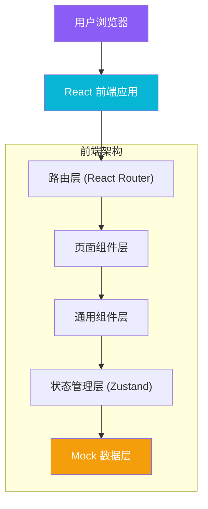
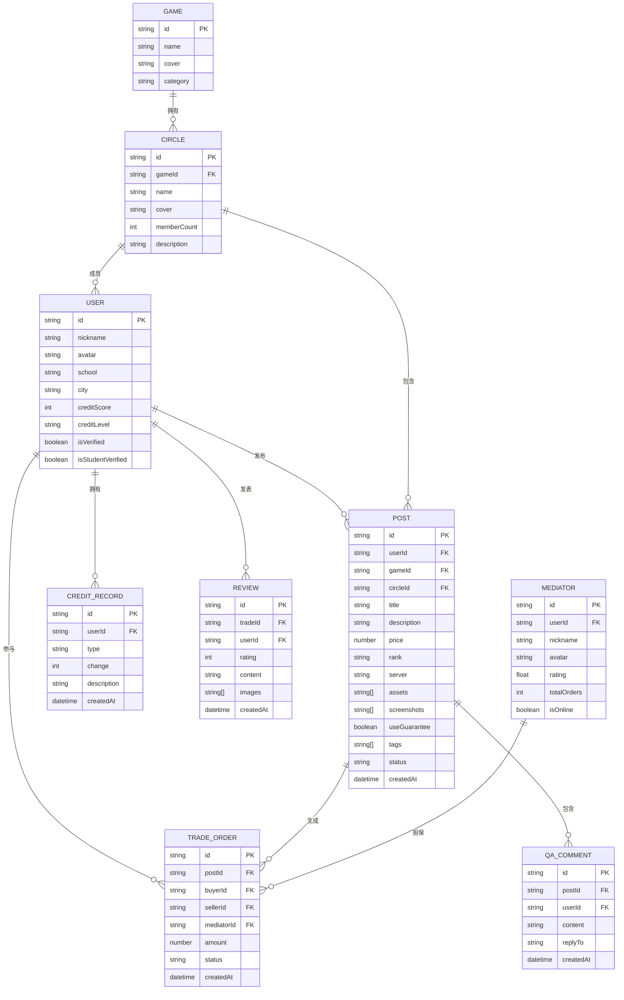

## 1. 架构设计



## 2. 技术描述

- **前端框架**：React 18 + TypeScript
- **构建工具**：Vite 5
- **样式方案**：Tailwind CSS 3 + PostCSS
- **路由管理**：React Router DOM 6
- **状态管理**：Zustand
- **图标库**：Lucide React
- **后端服务**：无（纯前端项目，使用 Mock 数据模拟）
- **数据存储**：Zustand 内存状态 + localStorage 持久化
- **初始化工具**：vite-init 使用 react-ts 模板

## 3. 路由定义

| 路由路径 | 页面名称 | 用途说明 |
|----------|----------|----------|
| `/` | 发现页 (Discover) | 平台首页，展示热门交易、避坑案例、价格参考、同校圈子 |
| `/circle/:gameId` | 圈子页 (Circle) | 游戏兴趣圈主页，展示圈内动态、信用排行、成员列表 |
| `/trade/:postId` | 担保交易页 (Trade) | 交易详情页，账号展示、问答、中介选择、担保下单 |
| `/post` | 发帖页 (PostCreate) | 发布交易帖，填写账号信息、上传截图、设置交易条款 |
| `/profile` | 个人页 (Profile) | 用户个人中心，信用等级、交易管理、晒号反馈 |

## 4. 数据模型

### 4.1 数据模型定义



### 4.2 核心数据 TypeScript 类型定义

```typescript
// 用户
interface User {
  id: string;
  nickname: string;
  avatar: string;
  school: string;
  city: string;
  creditScore: number;
  creditLevel: 'bronze' | 'silver' | 'gold' | 'platinum' | 'diamond';
  isVerified: boolean;
  isStudentVerified: boolean;
}

// 游戏
interface Game {
  id: string;
  name: string;
  cover: string;
  category: string;
}

// 圈子
interface Circle {
  id: string;
  gameId: string;
  name: string;
  cover: string;
  memberCount: number;
  description: string;
  members: User[];
}

// 交易帖
interface Post {
  id: string;
  userId: string;
  gameId: string;
  circleId: string;
  title: string;
  description: string;
  price: number;
  rank: string;
  server: string;
  assets: string[];
  screenshots: string[];
  useGuarantee: boolean;
  tags: string[];
  status: 'active' | 'trading' | 'sold' | 'closed';
  createdAt: string;
  user: User;
  game: Game;
}

// 中介员
interface Mediator {
  id: string;
  userId: string;
  nickname: string;
  avatar: string;
  rating: number;
  totalOrders: number;
  isOnline: boolean;
}

// 交易订单
interface TradeOrder {
  id: string;
  postId: string;
  buyerId: string;
  sellerId: string;
  mediatorId: string;
  amount: number;
  status: 'pending' | 'paid' | 'delivering' | 'completed' | 'disputed' | 'cancelled';
  createdAt: string;
}

// 问答评论
interface QAComment {
  id: string;
  postId: string;
  userId: string;
  content: string;
  replyTo?: string;
  createdAt: string;
  user: User;
}

// 评价晒号
interface Review {
  id: string;
  tradeId: string;
  userId: string;
  rating: number;
  content: string;
  images: string[];
  createdAt: string;
  user: User;
}

// 避坑案例
interface PitfallCase {
  id: string;
  title: string;
  content: string;
  type: 'exposure' | 'experience' | 'guide';
  images: string[];
  createdAt: string;
  user: User;
}

// 价格参考
interface PriceReference {
  gameId: string;
  rank: string;
  minPrice: number;
  maxPrice: number;
  avgPrice: number;
}
```

## 5. 前端目录结构

```
src/
├── components/           # 通用组件
│   ├── layout/          # 布局组件
│   │   ├── Header.tsx   # 顶部导航
│   │   ├── BottomNav.tsx # 移动端底部导航
│   │   └── Container.tsx # 容器布局
│   ├── trade/           # 交易相关组件
│   │   ├── PostCard.tsx # 交易帖卡片
│   │   ├── PriceRange.tsx # 价格区间
│   │   ├── QASection.tsx # 问答区
│   │   └── MediatorList.tsx # 中介员列表
│   ├── circle/          # 圈子相关组件
│   │   ├── CircleCard.tsx # 圈子卡片
│   │   ├── CreditRank.tsx # 信用排行
│   │   └── MemberList.tsx # 成员列表
│   ├── user/            # 用户相关组件
│   │   ├── UserAvatar.tsx # 用户头像
│   │   ├── CreditBadge.tsx # 信用徽章
│   │   └── ReviewCard.tsx # 评价卡片
│   └── common/          # 基础通用组件
│       ├── Button.tsx   # 按钮
│       ├── Tag.tsx      # 标签
│       ├── Modal.tsx    # 弹窗
│       └── Empty.tsx    # 空状态
├── pages/               # 页面组件
│   ├── Discover.tsx     # 发现页
│   ├── Circle.tsx       # 圈子页
│   ├── Trade.tsx        # 担保交易页
│   ├── PostCreate.tsx   # 发帖页
│   └── Profile.tsx      # 个人页
├── store/               # Zustand 状态管理
│   └── index.ts
├── data/                # Mock 数据
│   ├── users.ts
│   ├── games.ts
│   ├── posts.ts
│   ├── circles.ts
│   ├── mediators.ts
│   └── pitfalls.ts
├── types/               # TypeScript 类型定义
│   └── index.ts
├── utils/               # 工具函数
│   ├── format.ts        # 格式化工具
│   └── credit.ts        # 信用计算
├── App.tsx              # 根组件
├── main.tsx             # 入口文件
├── index.css            # 全局样式与 Tailwind
└── router.tsx           # 路由配置
```

## 6. 状态管理设计

使用 Zustand 管理全局状态，按模块拆分：

```typescript
// store/index.ts
interface AppState {
  // 用户模块
  currentUser: User | null;
  
  // 帖子模块
  posts: Post[];
  activePost: Post | null;
  
  // 圈子模块
  circles: Circle[];
  activeCircle: Circle | null;
  
  // 交易模块
  orders: TradeOrder[];
  mediators: Mediator[];
  
  // 问答模块
  qaComments: QAComment[];
  
  // Actions
  setCurrentUser: (user: User) => void;
  setPosts: (posts: Post[]) => void;
  setActivePost: (post: Post | null) => void;
  setCircles: (circles: Circle[]) => void;
  addQAComment: (comment: QAComment) => void;
  createPost: (post: Omit<Post, 'id' | 'createdAt'>) => void;
}
```

## 7. 设计规范与约束

- 设计基准：桌面端 1440px，移动端 375px
- 栅格系统：Tailwind 默认 12 列栅格
- 间距：使用 Tailwind 标准 spacing scale (4px 基准)
- 字号：text-xs (12px) ~ text-4xl (36px)，不超过 5 级字号
- 颜色变量：在 tailwind.config.js 中定义主题色板
- 动画：统一使用 200-300ms 过渡时间，ease-out 缓动函数
- 组件行数限制：单组件不超过 300 行，超过需拆分
